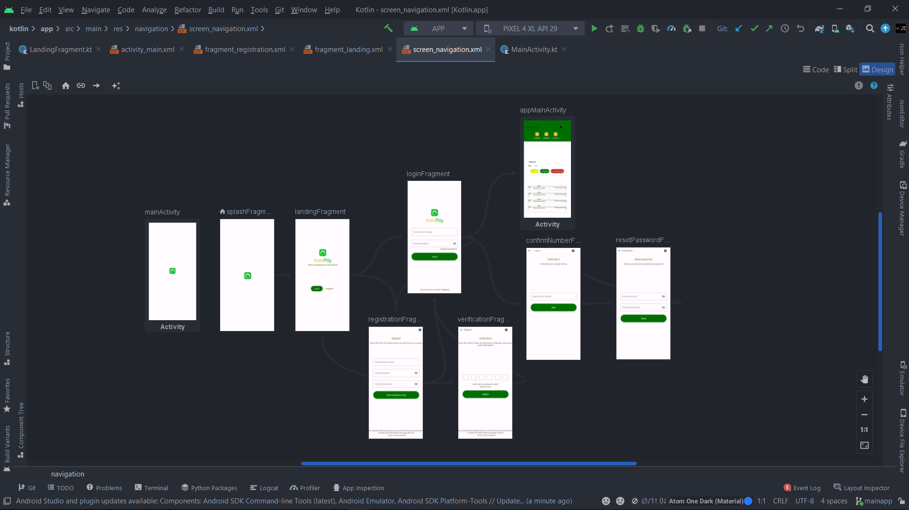
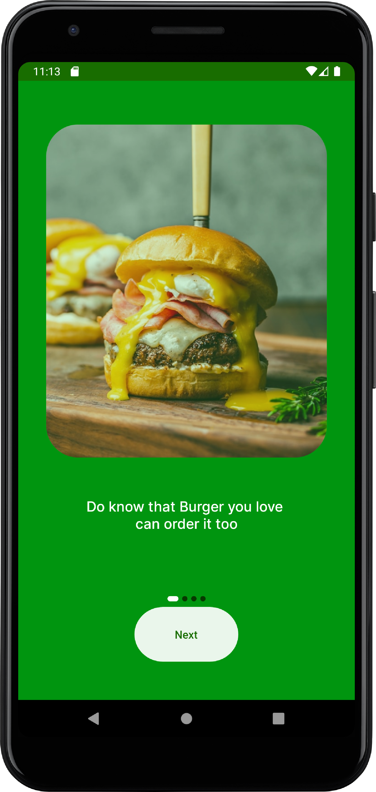
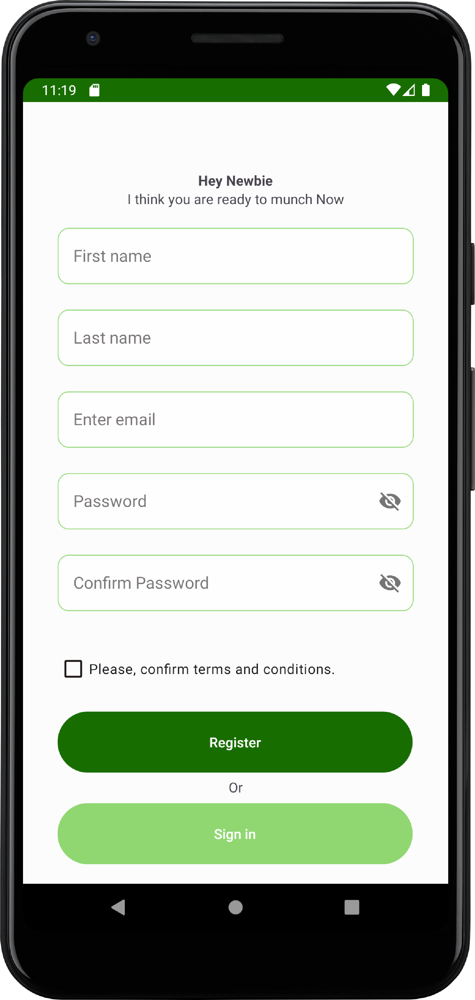
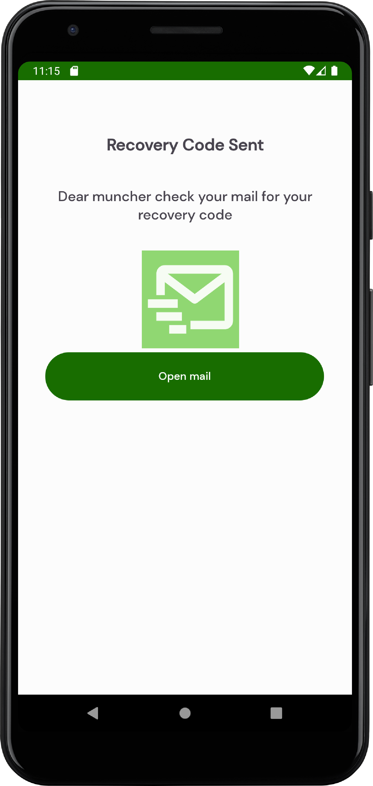
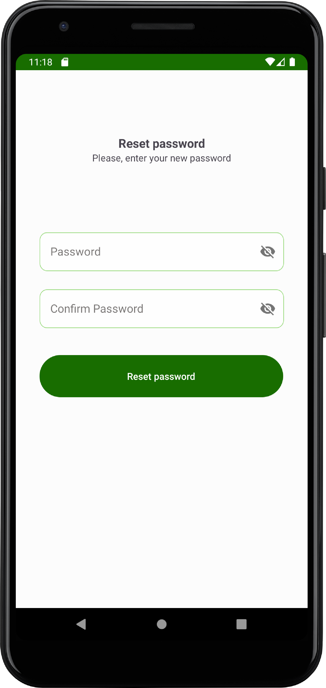
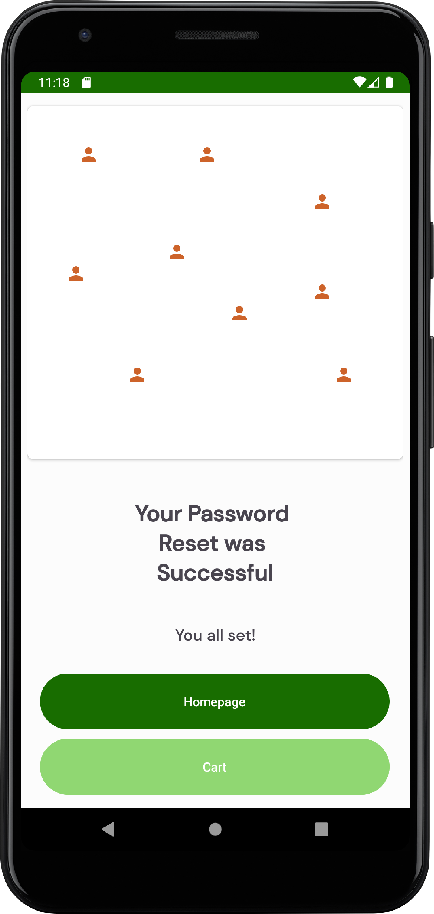

# Online food delivery system
Munchy, an online food delivery system written in kotlin, java, postgres and ktor as the backend where users can order food and place order.

## Overview
The application contains list of food stuffs which user can click to view its details and then, add them to cart. User can like and dislike the food as well. 
Also, User can sell food, if he/she signed up as a waiter/ restaurant manager.
Some other features are as following:
- Authentication process such as </b> Login, Sign up and reset password process
- Recyclerview with variable span size to show products.
- Search Bar and filtering
- Product detail screen with image carousel and custom Radio Buttons.
- Add/Edit Product for Sellers
- See all orders placed.
- Increase/Decrease quantity of product in the cart.
- Place Order.
- Modify status of order for Seller.
- Add/Edit Address
- Tested using Espresso. Written unit, instrumentation and UI tests.

## Munchy Application screenshots
|                                           authentication mobile navigation                                |
| :-------------------------------------------------------------------------------------------------------: |
|                                                                     |

## onBoarding screens

|      Screen 1               |             Screen 2        |           Screen 3          |
| :-------------------------: | :-------------------------: | :--------------------------:|
|  |  |  |

## authentication screens
|                 Signup              |           Sign up Agreement        |             Login            |
| :---------------------------------: | :--------------------------------: | :---------------------------:|
|    |  |    |

## Password reset process

|           Email verification            |             Open email link            |             OTP                    |               Password reset        |         Reset all done          |
| :-------------------------------------: | :------------------------------------: | :---------------------------------:| :---------------------------------: | :----------------------------:  |
|  |         |  |  |  |

## Stack
- Kotlin
- Java
- Postgres
- Room
- Datastore
-Exposed
- Material component
- Glide